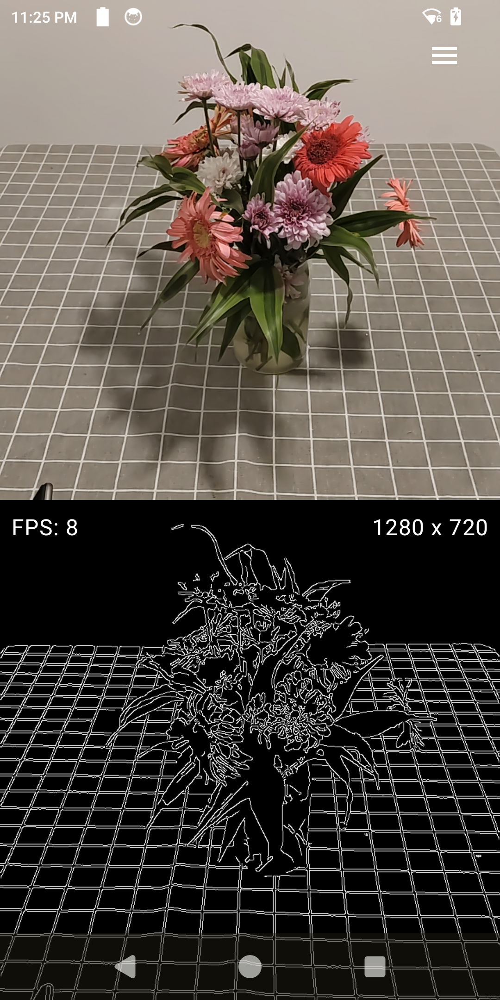

# VisionX Starter - Kotlin + OpenCV + CameraX Image Processing for Android

<div align="center">
  
</div>

> 🚀 **A beginner-friendly starter kit for image processing on Android using Kotlin, OpenCV, and CameraX.**
> 
> Perfect for learning, prototyping, and building computer vision apps!

## 🚀 Quick Start

### Clone and Open
```bash
git clone https://github.com/charitha-kariyawasam-dev/visionx-starter.git
cd visionx-starter
```

### Build
1. Open the project in **Android Studio**.
2. Perform a **Gradle Sync** (Android Studio may prompt you automatically, or you can use the "Sync Project with Gradle Files" button).
3. The project will automatically download and extract OpenCV for Android. This process may take up to **10 minutes** on slow internet connections. Please wait until the download and extraction are complete before building or running the app.

---

## ⚡ OpenCV Version

This project automatically downloads OpenCV for Android.

- **To change the OpenCV version:** Edit the following line in the **project-level** [`build.gradle.kts`](./build.gradle.kts#L8):
  ```kotlin
  val opencvVersion = "4.12.0"
  ```
  Set it to your desired version.

---

## 🏗️ Project Architecture (Beginner-Friendly)

```
📦 Your Project Structure
├── 🎯 Processing Tasks (ADD YOUR ALGORITHMS HERE!)
│   ├── EdgeDetectionTask.kt
│   ├── GrayscaleTask.kt
│   └── YourCustomTask.kt
│
├── 🎨 UI Components
│   ├── CameraScreen.kt
│   └── SettingsDialog.kt
│
├── 🧠 Business Logic
│   └── CameraViewModel.kt
│
└── ⚙️ Core Framework
    ├── GenericAnalyzer.kt
    ├── TaskRegistry.kt
    └── ProcessingTask.kt
```

---

## 🔧 Adding Your Own Image Processing Algorithm

### Step 1: Create Your Task
Create a new file in [`ProcessingTasks/`](app/src/main/java/com/ckbits/ai/model/ProcessingTasks/) folder:

```kotlin
// ProcessingTasks/YourCustomTask.kt
class YourCustomTask : ProcessingTask {
    override val name = "Your Algorithm"
    override val description = "Description of what it does"
    override val parameters = listOf(
        TaskParameter(
            key = "intensity",
            label = "Intensity",
            type = ParameterType.FLOAT,
            defaultValue = 1.0f,
            range = 0f..5f
        )
    )

    override fun process(input: Mat, params: Map<String, Any>): Mat {
        val intensity = (params["intensity"] as? Float) ?: 1.0f
        val output = Mat()
        Imgproc.yourFunction(input, output, intensity.toDouble())
        return output
    }
}
```

### Step 2: Register Your Task
Register your new task in [`TaskRegistry.kt`](app/src/main/java/com/ckbits/ai/model/TaskRegistry.kt#L13):

```kotlin
// TaskRegistry.kt
val tasks = listOf(
    EdgeDetectionTask(),
    GrayscaleTask(),
    YourCustomTask() // Add your task here
)
```

## 🤝 Contributing & Feedback

I absolutely **love** Pull Requests and feedback from the community! This project is designed to help beginners learn computer vision and Android development, and your contributions can make it even better.

- 🐛 **Bug Reports**
- 💡 **Feature Requests**
- 🔧 **Code Contributions**
- 📚 **Documentation**
- 🎨 **Examples**

**Happy Coding! 🚀**
